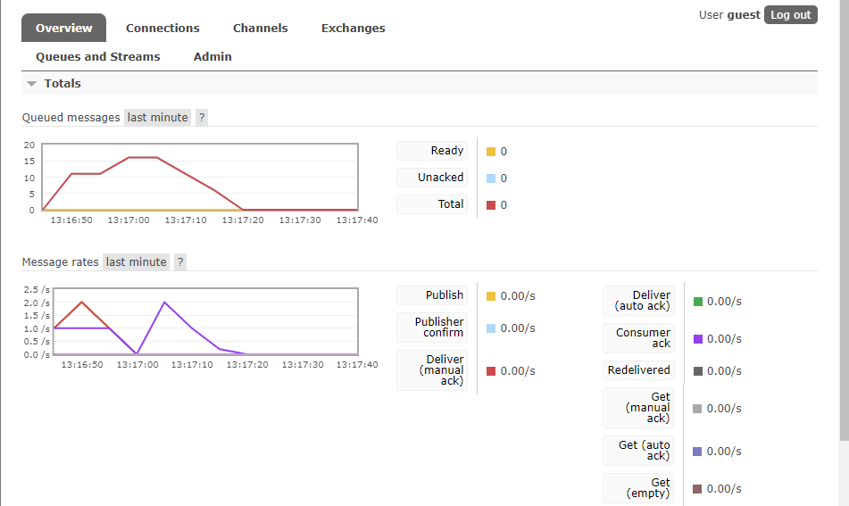

## What is amqp? 
AMQP stands for Advanced Message Queuing Protocol. It is an open standard protocol for message-oriented middleware that enables applications to communicate with each other over a network. It provides a reliable and efficient way to exchange messages between different systems, making it ideal for building distributed and scalable applications.

## what it means? guest:guest@localhost:5672 , what is the first quest, and what is the second guest, and what is localhost:5672 is for?

The provided URL serves as the connection point to the AMQP server. The initial part represents the RabbitMQ username, followed by the password for authentication. The specification "localhost:5672" indicates that the AMQP server will be hosted locally and will utilize port 5672 for incoming connections.

## Simulating slow subscriber
