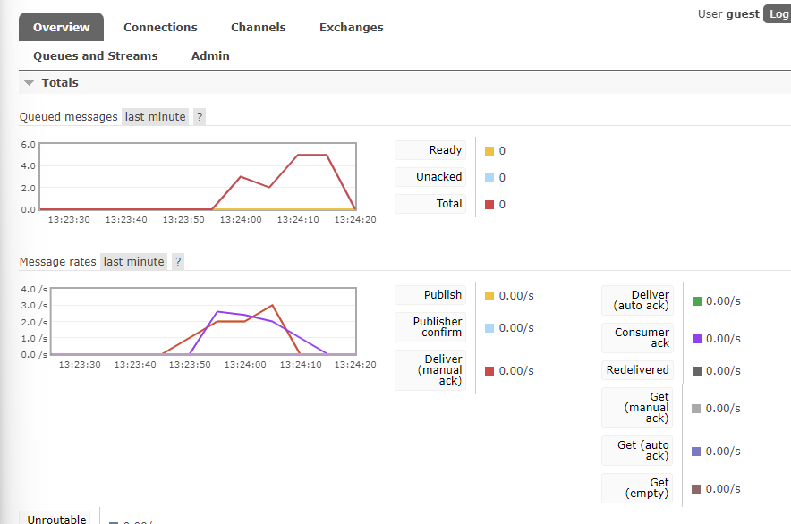
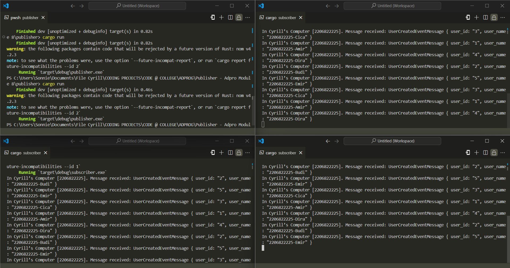

## What is amqp? 
AMQP stands for Advanced Message Queuing Protocol. It is an open standard protocol for message-oriented middleware that enables applications to communicate with each other over a network. It provides a reliable and efficient way to exchange messages between different systems, making it ideal for building distributed and scalable applications.

## what it means? guest:guest@localhost:5672 , what is the first quest, and what is the second guest, and what is localhost:5672 is for?

The provided URL serves as the connection point to the AMQP server. The initial part represents the RabbitMQ username, followed by the password for authentication. The specification "localhost:5672" indicates that the AMQP server will be hosted locally and will utilize port 5672 for incoming connections.

## Simulating slow subscriber

 In the image above, I've configured the subscriber to be slow in receiving or handling data from the message broker, introducing a one-second delay for each process. Consequently, the number of queued messages on the message broker increases as the delay grows, since the publisher sends data faster than the subscriber can receive it. In my case, the number of queued messages on the message broker is six after running the Publisher twice.

## Running at least three subscribers

I replicated the process from the Simulation slow subscriber section. Running multiple subscribers results in significantly faster data transmission, and in my experiment, there were no entries in the queued messages on the message broker. This occurs because the message broker distributes received data from the Publisher among numerous connected subscribers.

By adjusting the message broker's configuration or the number of active subscribers without altering the program's code, we can achieve varying outcomes. This phenomenon illustrates the concept of event-driven architecture.